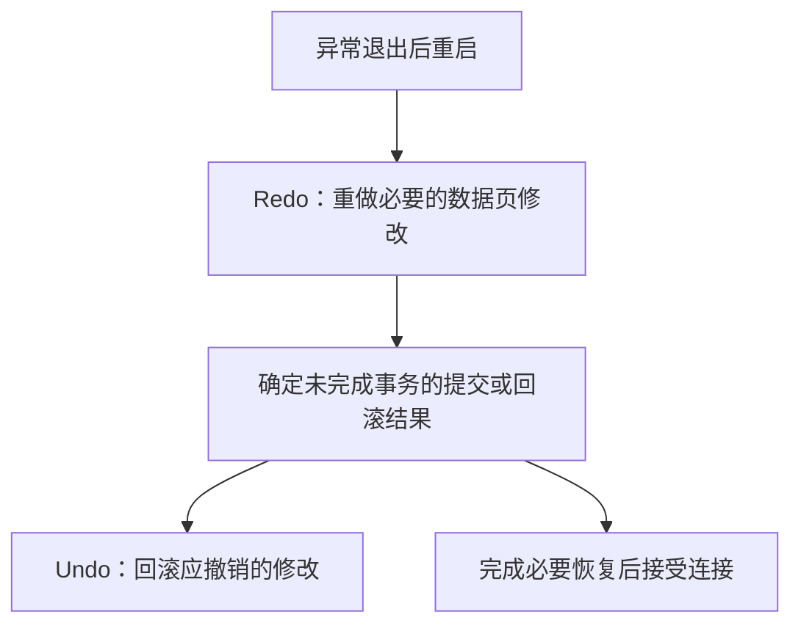

**MySQL 崩溃恢复是数据库异常退出后，在重启时恢复数据页并处理未完成事务的过程。** 以 InnoDB 为例，核心是用 [[mysql-redo-log|Redo Log]] 重做必要修改，再用 [[mysql-undo-log|Undo Log（回滚日志）]]撤销应回滚事务的修改，以维护[[transaction|事务]]的原子性和持久性。

**持久性是「提交后的修改应被保留」这一目标，崩溃恢复是保障这一目标的机制之一。** 恢复还要撤销应回滚的修改，因此同时涉及原子性，两者不是同一个概念。

这是核心过程的简化图。Redo 重放可能包含未提交事务的修改，不是只恢复已提交数据；部分回滚可以在后台继续，与新请求并行，因此恢复服务不一定要等所有回滚结束。

## Binlog 是否参与

**普通数据页恢复不靠重放 [[mysql-binlog|Binlog]]，但开启 Binlog 后，它会参与事务提交状态的判定。** MySQL 用内部两阶段提交协调 InnoDB 与 Binlog；对于停在 Prepared（已准备、尚未完成提交）状态的内部事务，恢复时检查 Binlog 中的有效事务记录，决定完成提交还是回滚。

因此可以区分三个职责：Redo 重做页修改，Undo 撤销修改，Binlog 为相关事务提供提交判定依据。已提交数据不丢失的保证以正确的持久化配置和可靠存储为前提，例如 `innodb_flush_log_at_trx_commit=1`、`sync_binlog=1`。

这与误删、磁盘损坏后的数据恢复不同：后者通常需要恢复备份，再利用 Binlog 推进到目标时间点；针对误操作，也可在满足条件时通过 [[binlog-recovery|Binlog 生成补偿 SQL]]。

参考：[InnoDB Recovery](https://dev.mysql.com/doc/refman/8.4/en/innodb-recovery.html)、[Binlog 与事务恢复](https://dev.mysql.com/doc/refman/8.4/en/binary-log.html)。
