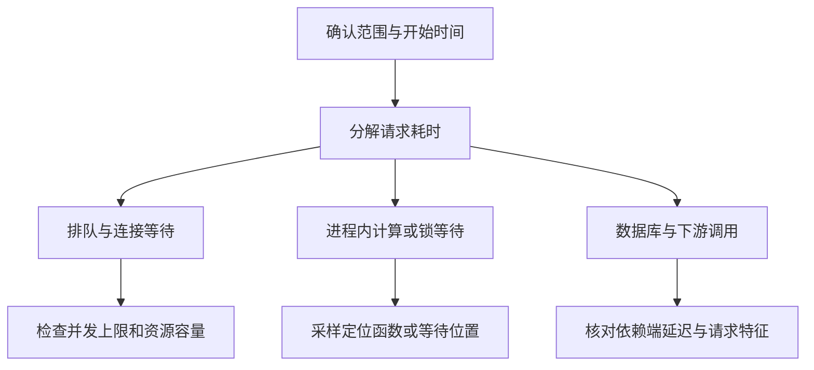

接口变慢先定位耗时出现在哪一段，再判断该段为什么等待或执行变慢。平均延迟只能说明总体变化，不能代替分位数、请求量和受影响范围。

先按接口、版本、实例、机房和用户群比较延迟、错误率与流量，区分全局变慢还是少量慢请求。把开始时间与发布、扩缩容、定时任务、依赖变更对应起来，[[periodic-outage|周期性故障]]还需对齐多次异常的时间线，但时间重合只提供线索，不能直接证明因果。

[[opentelemetry|链路追踪]] 用于定位慢调用所在的服务与阶段；父 Span 的耗时包含子调用，不能把嵌套时间全部相加。并行子调用的关键路径也不等于各分支之和。缺少排队或连接获取埋点时，“业务函数很快”仍可能对应端到端很慢。

进程内 CPU 高时用 [[go-cpu-investigation|性能采样]] 找热点；CPU 不高时重点观察锁、连接、磁盘和网络等待；[[linux-load-investigation|系统负载]]可以提供任务排队与阻塞线索。数据库侧区分 [[db-connection-pool|连接池排队]] 与 SQL 执行；SQL 已定位后再读 [[mysql-explain|执行计划]]。Redis 需要同时检查客户端与 [[redis-troubleshooting|服务端延迟]]。

止损可采用限流、回滚或隔离故障依赖，但应保留关键指标和现场。修复后用同类流量验证延迟、吞吐及错误率，避免通过拒绝更多请求换来表面上的“变快”。
