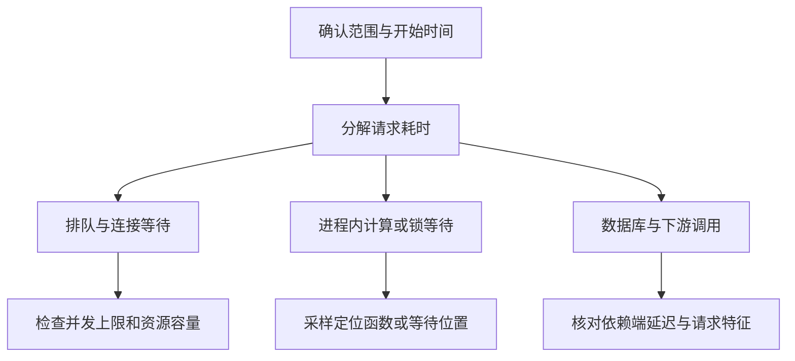

> 面试回答见：[[slow-api-interview|接口变慢排查（面试回答）]]。

**排查接口变慢的出发点是先定位耗时出现在哪一段，再判断那一段为什么等待或执行变慢**，而不是先猜原因或直接加资源。平均延迟只能说明总体变化，不能代替分位数、请求量和受影响范围。

## 排查思路

1. **缩小范围**，先确认是否真的变慢、影响谁：
   - 指标：在监控面板按接口、版本、实例、机房、用户群对比延迟分位数（P50/P95/P99）、错误率、QPS 与超时率，区分全局变慢和少量慢请求；
   - 日志：翻错误、超时、慢查询、GC 等日志，看是否有集中出现的异常或依赖报错；
   - 链路：抓几条慢请求的 trace，看耗时集中在哪个服务或阶段；
   - 时间线：把起始时间与发布、扩缩容、定时任务、依赖变更对齐，[[periodic-outage|周期性故障]]还要对齐多次异常的时间线；时间重合只是线索，不能直接当成因果。
2. **分解耗时**。把端到端时间拆到几类阶段，再判断主要是哪一类：

3. **逐段取证**。用 [[opentelemetry|链路追踪]] 定位慢调用所在的服务与阶段；父 Span 的耗时包含子调用，不能把嵌套时间全部相加，并行子调用的关键路径也不等于各分支之和。缺少排队或连接获取埋点时，「业务函数很快」仍可能对应端到端很慢。
4. **按现象选工具**。CPU 高时用 [[go-cpu-investigation|性能采样]] 找热点；CPU 不高时重点观察锁、连接、磁盘和网络等待，[[linux-load-investigation|系统负载]]可提供任务排队与阻塞线索。数据库侧区分 [[db-connection-pool|连接池排队]] 与 SQL 执行，SQL 已定位后再读 [[mysql-explain|执行计划]]；Redis 需要同时检查客户端与 [[redis-troubleshooting|服务端延迟]]。

止损可采用限流、回滚或隔离故障依赖，但要保留关键指标和现场；修复后用同类流量验证延迟、吞吐及错误率，避免通过拒绝更多请求换来表面的「变快」。
