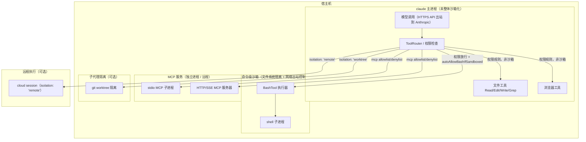

## Q1
本项目把哪些组件放进沙箱：整个 Agent 进程、单次 shell 命令，还是远程执行服务？请画出模型调用、Agent 主进程、工具执行器、子进程与宿主机之间的边界。文件工具、浏览器、MCP 服务是否经过同一边界？
### Answer
## 结论

沙箱的粒度是**单次 shell 命令**（`BashTool` 的文件系统 + 网络出站隔离），而不是整个 Agent 进程；整个进程级的隔离是可选的 devcontainer 部署形态；子代理还可以选择 `worktree` 或 `remote`（云端会话）级别的隔离。 claude-code:2593-2593 claude-code:432-436 claude-code:1-15 

文件工具、浏览器、MCP 服务**不经过同一边界**：它们走权限规则（permission rules）和独立进程/远程连接，而非 Bash 沙箱。 claude-code:2640-2643 claude-code:4101-4103 

---

## 边界模型



## 各边界说明

### 1. 命令级沙箱（主要沙箱）
- `sandbox.filesystem.disabled` 设置可"跳过文件系统隔离但保留网络出站控制"，说明 Bash 执行的默认边界同时包含 filesystem isolation 和 network egress control。 claude-code:2593-2593 
- `autoAllowBashIfSandboxed` 表示权限系统与沙箱联动：命令已被沙箱化时可自动批准。 claude-code:4112-4112 
- IDE 交互有专门的"sandbox command restrictions"。 claude-code:2557-2557 

### 2. Agent 主进程：默认不沙箱化
- 主进程在宿主机上运行，靠权限层（permission prompts、`Bash(...)`/`Edit(...)` 规则、auto-mode classifier）做门禁，而非进程隔离。 claude-code:2556-2560 
- 可选的"整进程"方案是 `.devcontainer`：容器 + `init-firewall.sh` 网络防火墙，需要 `NET_ADMIN`/`NET_RAW` 能力。 claude-code:12-15 claude-code:55-56 

### 3. 子代理隔离
- `AgentSpec.isolation?: 'worktree' | 'remote'`：worktree 给子代理独立 git checkout（并有防 `git -C`/`GIT_DIR` 逃逸的修复），`remote` 走云端会话。 claude-code:432-436 claude-code:2600-2602 

### 4. 其他工具不共用此边界
| 工具 | 边界 |
|---|---|
| `Read`/`Edit`/`Write` | 权限规则（如 `Edit(src/**)` 前缀匹配），在 Agent 进程内执行，不进命令沙箱。 claude-code:2640-2640  |
| 浏览器 | 独立机制（Claude-in-Chrome），有自身的认证/会话处理。 claude-code:2609-2609  |
| MCP stdio | 独立子进程，注入 `CLAUDE_PROJECT_DIR`；managed allowlist/denylist 控制。 claude-code:4101-4101 claude-code:2522-2522  |
| MCP HTTP/SSE | 远程连接，响应体有 16 MB/SSE 帧上限。 claude-code:4114-4114  |

## Notes
- 本回答基于 CHANGELOG、类型声明和 devcontainer 配置；仓库未包含 `BashTool` 的实际沙箱实现代码，因此"命令级沙箱"的具体机制（如 seatbelt/bubblewrap）无法从上下文确认。
- 权限系统与沙箱是两层独立防线：权限决定"是否允许执行"，沙箱限制"执行时能触及什么"。

Wiki pages you might want to explore:
- [Claude Code Overview (anthropics/claude-code)](/wiki/anthropics/claude-code#1)
### Citations
**File:** CHANGELOG.md (L2522-2522)
```markdown
- Changed managed MCP allowlist/denylist `${VAR}` entries to resolve from the startup environment and managed-settings env instead of settings-file env
```
**File:** CHANGELOG.md (L2556-2560)
```markdown
- Improved auto mode: the dangerous-rm, background-`&`, and suspicious-Windows-path checks no longer open permission dialogs; the auto-mode classifier adjudicates them instead
- Improved sandbox command restrictions for IDE interactions
- Improved trust dialogs to name the repository root the grant covers
- Changed `/deep-research` to start only when invoked manually; Claude no longer launches it on its own
- Changed plan mode with auto to no longer prompt for Bash commands the static analyzer can't prove read-only; the auto-mode classifier judges them instead
```
**File:** CHANGELOG.md (L2593-2593)
```markdown
- Added `sandbox.filesystem.disabled` setting to skip filesystem isolation while keeping network egress control
```
**File:** CHANGELOG.md (L2600-2602)
```markdown
- Fixed worktree-isolated subagents redirecting git into the shared checkout via `git -C`, `--git-dir`, or `GIT_DIR`/`GIT_WORK_TREE`
- Fixed worktree sessions landing in another project's leftover worktree when the working directory did not match the selected project
- Fixed background sessions whose worktree has no git repository being undeletable
```
**File:** CHANGELOG.md (L2609-2609)
```markdown
- Fixed Claude-in-Chrome 403-looping on reconnect when the session's OAuth token lacks a required scope
```
**File:** CHANGELOG.md (L2640-2643)
```markdown
- Fixed single-segment `dir/**` allow rules like `Edit(src/**)` auto-approving writes to nested `dir/` directories anywhere in the tree instead of only `<cwd>/dir`
- Fixed a permission-check bypass affecting commands run in Windows PowerShell 5.1 sessions
- Fixed Bash permission checks to fail closed on file-descriptor redirect forms that bash parses differently than the permission analyzer
- Fixed Bash permission checks misjudging very long commands — commands over 10,000 characters now always prompt instead of running automatically
```
**File:** CHANGELOG.md (L4101-4103)
```markdown
- MCP stdio servers now receive `CLAUDE_PROJECT_DIR` in their environment, matching hooks. Plugin configs can reference `${CLAUDE_PROJECT_DIR}` in commands
- Compaction prompt now asks the model to preserve sensitive user instructions
- `/mcp` Reconnect now picks up `.mcp.json` edits without a restart, and shows the HTTP status and URL when reconnecting fails
```
**File:** CHANGELOG.md (L4112-4112)
```markdown
- Fixed `autoAllowBashIfSandboxed` not auto-approving commands with shell expansions like `$VAR` and `$(cmd)`
```
**File:** CHANGELOG.md (L4114-4114)
```markdown
- Fixed unbounded memory growth when an HTTP/SSE MCP server streams non-protocol data — response bodies now capped at 16 MB per SSE frame
```
**File:** mods/types/claude-code.d.ts (L432-436)
```typescript
      /**
       * Where the agent runs apart from the session: `worktree`, a git worktree
       * of its own; `remote`, a cloud session where the build allows one.
       */
      isolation?: 'worktree' | 'remote';
```
**File:** .devcontainer/devcontainer.json (L1-15)
```json
{
  "name": "Claude Code Sandbox",
  "build": {
    "dockerfile": "Dockerfile",
    "args": {
      "TZ": "${localEnv:TZ:America/Los_Angeles}",
      "CLAUDE_CODE_VERSION": "latest",
      "GIT_DELTA_VERSION": "0.18.2",
      "ZSH_IN_DOCKER_VERSION": "1.2.0"
    }
  },
  "runArgs": [
    "--cap-add=NET_ADMIN",
    "--cap-add=NET_RAW"
  ],
```
**File:** .devcontainer/devcontainer.json (L55-56)
```json
  "postStartCommand": "sudo /usr/local/bin/init-firewall.sh",
  "waitFor": "postStartCommand"
```
