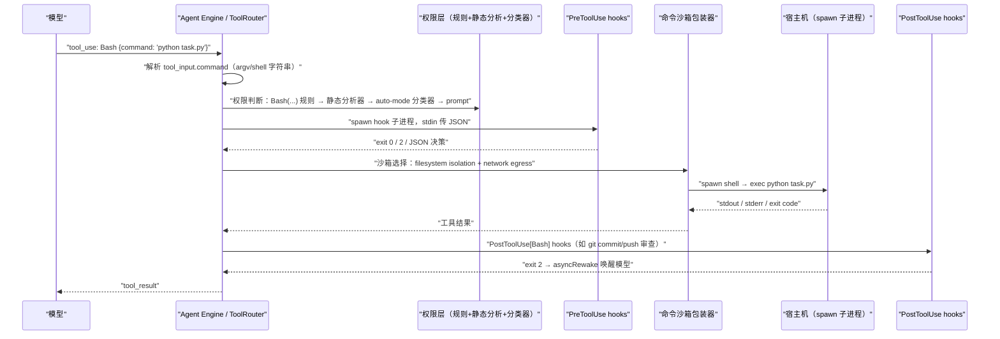

## Q2
请以 Agent 执行 python task.py 为例，从工具调用入口追踪到实际创建进程的位置。依次说明参数解析、权限判断、沙箱选择、限制配置、进程启动和结果回传，列出关键函数调用链。
### Answer
## 直接回答

这个仓库是 Claude Code 的**发布型仓库**（CHANGELOG、类型声明 `mods/types/claude-code.d.ts`、`.devcontainer`、插件），**不包含 `BashTool` 的实现源码**，因此无法给出精确到函数名的真实调用链。下面给出基于类型声明、hooks 协议和 CHANGELOG 证据能确认的执行管线，并标注每一步的证据或不确定性。 claude-code:2949-2966 claude-code:901-921 

---

## 推演管线：`Bash(command: "python task.py")`



## 逐步说明

### 1. 参数解析
- 模型产出 `tool_use` block，`tool_input.command` 是字符串 `"python task.py"`；hooks 侧可以确认这个字段名——security hook 用 `tool_input.get("command")` 取回同一字符串。 claude-code:911-917 
- 引擎侧有一个 **permission analyzer** 对命令做 bash 语义解析（处理重定向、shell 展开等），它与真实 bash 的解析差异曾是安全漏洞来源。 claude-code:2640-2643 

### 2. 权限判断（在进程创建之前）
- 依次匹配 `allow`/`deny`/`ask` 规则（如 `Bash(python:*)`）；静态分析无法证明只读的命令交给 **auto-mode classifier** 裁决；>10,000 字符的命令一律 prompt。 claude-code:2556-2560 claude-code:2643-2643 
- `autoAllowBashIfSandboxed`：若命令将被沙箱化则可自动批准——注意它曾对 `$VAR`、`$(cmd)` 展开失效。 claude-code:4112-4112 

### 3. PreToolUse / PostToolUse hooks
- Hook 配置中的 `"if": "Bash(git commit:*)"` 由 **CC 引擎**做命令前缀匹配后 spawn hook 进程，通过 stdin 传 `input_data`（`tool_name`、`tool_input`、`tool_response`、`cwd`、`session_id`）。 claude-code:916-921 claude-code:2035-2048 

### 4. 沙箱选择与限制配置
- 默认边界 = **filesystem isolation + network egress control**；`sandbox.filesystem.disabled` 可只关前者保留后者。 claude-code:2593-2593 
- 具体隔离机制（seatbelt/landlock 等）和 spawn 包装代码**不在本仓库索引中**，无法确认。

### 5. 进程启动
- 对 mods/插件而言，仓库唯一可见的进程 API 是 `$.process.run(argv, {cwd, env, stdin, timeoutMs})`——按 argv 无 shell 地运行，默认 cwd 为会话目录，超时默认 30 s、上限 10 分钟。 claude-code:2949-2965 
- `BashTool` 内部的实际 `spawn`/`exec` 位置没有源码可查。

### 6. 结果回传
- `BashTool` 的 `tool_response` 只含 `stdout`、`stderr`、`interrupted`，**没有 `exit_code` 字段**——这是 hook 注释中明确记录的事实，成功只能由输出文本推断。 claude-code:925-933 
- `$.process.run` 则返回 `{exitCode, stdout, stderr}`。 claude-code:2951-2965 
- PostToolUse hook 可以 `exit 2` 触发 **asyncRewake**，把 stderr 发现作为新输入唤醒模型。 claude-code:901-909 

## Notes
- **索引限制**：本仓库是 Claude Code 的元数据/插件镜像，`BashTool`、权限引擎和沙箱包装器的实现源码不在索引中。若需精确定位 `spawn` 调用点和函数名，请开一个 Devin session 访问完整代码。
- 上表中的"静态分析器 → auto-mode 分类器 → prompt"顺序依据 CHANGELOG 对 auto mode 裁决链的描述，非源码确认。 claude-code:2556-2560 

Wiki pages you might want to explore:
- [Claude Code Overview (anthropics/claude-code)](/wiki/anthropics/claude-code#1)
### Citations
**File:** mods/types/claude-code.d.ts (L2949-2966)
```typescript
      process: {
          /**
           * Runs a command on the host by its argument vector (no shell) and
           * resolves `{ exitCode, stdout, stderr }` once it exits, any exit code.
           *
           * One shot: the whole output is read, so a background process left
           * writing holds the call until the timeout. Rejects when the command
           * cannot start or is still running then. Git runs with repo hooks off.
           *
           * @param argv the command and its arguments, `argv[0]` the executable
           * @param init `{ cwd, env, stdin, timeoutMs }` (cwd the session's by
           *             default; timeout 30 s by default, ten minutes at most)
           * @returns `{ exitCode, stdout, stderr }` once the child exits
           * @example
           * const { exitCode, stdout } = await $.process.run(["git", "status"])
           */
          run: (argv: readonly string[], init?: ProcessRunInit) => Promise<ProcessRunResult>;
      };
```
**File:** plugins/security-guidance/hooks/security_reminder_hook.py (L901-921)
```python
def handle_commit_review_posttooluse(input_data):
    """PostToolUse handler for Bash — reviews git commits for security issues.

    Runs as asyncRewake: detects `git commit` in the Bash command, parses
    the resulting SHA(s) from the Bash stdout `[branch sha] msg` line, runs
    `git show -p <sha>` per SHA, sends the combined diff through
    analyze_code_security, and exits with code 2 (stderr findings) to wake
    the model. Deduplicates against the shared previous_findings state so
    the Stop hook won't re-flag the same (filePath, vulnerableCode) pair.
    """
    session_id = input_data.get("session_id", "default")
    tool_input = input_data.get("tool_input", {})
    tool_response = input_data.get("tool_response", {})
    cwd = input_data.get("cwd", "")

    command = tool_input.get("command", "")
    if not isinstance(command, str) or not _GIT_COMMIT_RE.search(command):
        # Defensive only — hooks.json's `"if": "Bash(git commit:*)"` is the
        # real gate so CC never spawns python3 for ls/grep/etc. This catches
        # cases where CC's command matching fails open and spawns the hook anyway.
        sys.exit(0)
```
**File:** plugins/security-guidance/hooks/security_reminder_hook.py (L925-933)
```python
    # Bash tool_response has no exit_code field (only stdout, stderr,
    # interrupted), so success is inferred from the output text — the same
    # heuristic Claude Code itself uses.
    if not isinstance(tool_response, dict):
        tool_response = {}
    stdout = tool_response.get("stdout", "") or ""
    stderr = tool_response.get("stderr", "") or ""
    bash_output = stdout + "\n" + stderr
    interrupted = bool(tool_response.get("interrupted"))
```
**File:** plugins/security-guidance/hooks/security_reminder_hook.py (L2035-2048)
```python
    # Read input from stdin
    try:
        raw_input = sys.stdin.read()
        input_data = json.loads(raw_input)
    except json.JSONDecodeError as e:
        debug_log(f"JSON decode error: {e}")
        emit_metrics({"skipped": True, "skip_reason": -2})
        sys.exit(0)

    session_id = input_data.get("session_id", "default")
    tool_name = input_data.get("tool_name", "")
    tool_input = input_data.get("tool_input", {})
    hook_event_name = input_data.get("hook_event_name", "")
    debug_log(f"Processing: hook_event={hook_event_name}, tool={tool_name}")
```
