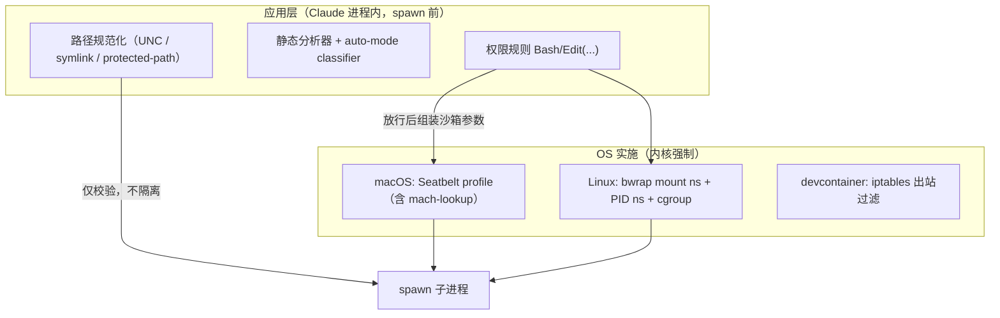

## Q3
本项目在不同操作系统上分别使用什么隔离机制？请追踪权限配置如何转换成 Seatbelt profile、bubblewrap 参数、容器配置、系统调用过滤规则或虚拟机配置。哪些限制由操作系统实施，哪些只是应用层检查？
### Answer
## 直接回答

从这个仓库（发布型仓库，无沙箱实现源码）的 CHANGELOG 与配置可确认的分平台隔离机制是：**Linux/WSL 用 bubblewrap（`sandbox.bwrapPath`）+ socat（`sandbox.socatPath`）做文件系统与网络隔离，可选 PID namespace 与 memory cgroup；macOS 用 Seatbelt（`sandbox.network.allowMachLookup` 暴露的是 Seatbelt profile 的 mach-lookup 规则）；Windows 没有对应的 OS 级沙箱证据，只有应用层路径/权限校验；整进程级隔离只有可选的 devcontainer + iptables 防火墙；没有虚拟机或系统调用过滤（seccomp）配置的证据。** 权限配置→沙箱参数的转换代码不在本仓库索引中，无法追踪。 claude-code:4210-4211 claude-code:4863-4863 claude-code:4903-4903 claude-code:55-56 

---

## 分平台机制

| OS | OS 实施的隔离 | 证据 |
|---|---|---|
| **Linux / WSL** | bubblewrap（`bwrap`）文件系统隔离 + `socat` 网络出口代理；`CLAUDE_CODE_SUBPROCESS_ENV_SCRUB` 时启用 **PID namespace**；`CLAUDE_CODE_TOOL_MEMORY_LIMIT` 启用 **memory cgroup** | claude-code:4210-4211 claude-code:4863-4863 claude-code:2216-2216  |
| **macOS** | Seatbelt（sandbox-exec）profile——`sandbox.network.allowMachLookup` 直接对应 Seatbelt 的 `(allow mach-lookup ...)` 规则，证明网络域过滤以 Seatbelt profile 形式下发给内核 | claude-code:4903-4903  |
| **Windows** | 索引中**没有** OS 级沙箱证据；可见的是 UNC/`\??\` 路径校验（防 NTLM 凭据泄漏）、Git Bash symlink、PowerShell 5.1 参数解析加固——全部是**应用层检查**，发生在 spawn 之前 | claude-code:2224-2224 claude-code:2249-2250  |
| **容器（可选，整进程）** | `.devcontainer`：`init-firewall.sh` 配 iptables 出站白名单，需要 `NET_ADMIN`/`NET_RAW` | claude-code:12-15 claude-code:55-56  |
| **虚拟机 / seccomp** | **无证据**。子代理的 `isolation: 'remote'` 是云端会话（实现不可见），不是本机 VM | claude-code:432-436  |

## 权限配置 → 沙箱参数的转换点

可确认的配置面（即"权限/沙箱配置"如何落到二进制参数）：

- `sandbox.bwrapPath` / `sandbox.socatPath`：managed settings 指定 bwrap/socat 二进制位置——说明引擎在 spawn 前组装 `bwrap` 命令行与 socat 代理转发，sandbox 二进制本身可被管理策略覆盖且需审批。 claude-code:4210-4211 claude-code:2270-2270 
- `sandbox.ripgrep`：沙箱内使用的 ripgrep 二进制，只允许 user/managed/`--settings` 层覆盖（project 层不可），说明沙箱把受信二进制映射进隔离环境。 claude-code:2284-2284 
- `sandbox.filesystem.disabled`：只关文件系统隔离、保留网络出口控制——即 bwrap/Seatbelt 的文件系统规则与 socat 网络规则是**两个可独立开关的维度**。 claude-code:2593-2593 
- 网络域列表：IPv6 字面量写成 `[::1]:443`、歧义写法 fail-closed——这是域名白名单转换为出口过滤规则时的规范化逻辑。 claude-code:2318-2318 
- "Linux filesystem sandbox" 曾修复 protected-path 绕过，说明存在一份由配置生成的"保护路径"集合传入 bwrap。 claude-code:2283-2283 

生成 Seatbelt profile 文本 / bwrap argv 的具体函数不在索引中，无法给出函数级调用链。

## OS 实施 vs 应用层检查



- **OS 实施**：Seatbelt（macOS 内核强制文件/网络/mach 访问）、bwrap 的 mount/PID namespace 与 cgroup（Linux 内核强制）、devcontainer iptables。绕过它们需要内核级逃逸。 claude-code:4903-4903 claude-code:4863-4863 
- **仅应用层**：`Bash(...)`/`Edit(...)` 权限规则、静态分析器、auto-mode classifier、Windows 路径校验、worktree git 隔离——都在 Claude 进程内判定，子进程本身不受内核约束。 claude-code:2640-2643 claude-code:2600-2602 

## Notes
- `BashTool`、Seatbelt profile 生成器、bwrap argv 组装器的实现源码不在本仓库索引中；如需逐行追踪，请开 Devin session 访问完整二进制源码。
- socat 的角色推断为"沙箱内进程 → 主机侧域名过滤代理"的出口转发，依据是它与 bwrap 成对配置且网络域列表独立存在，但源码未确认。 claude-code:4210-4211 
- `sandbox.network.allowMachLookup` 名称中 "Mach" 指 macOS Mach IPC port，非宿主机含义。 claude-code:4903-4903 

Wiki pages you might want to explore:
- [Claude Code Overview (anthropics/claude-code)](/wiki/anthropics/claude-code#1)
### Citations
**File:** CHANGELOG.md (L2216-2216)
```markdown
- Added opt-in memory cgroup support for Bash tool commands on Linux (`CLAUDE_CODE_TOOL_MEMORY_LIMIT`) so a runaway build can't stall the session
```
**File:** CHANGELOG.md (L2224-2224)
```markdown
- Fixed Windows paths spelled with the NT `\??\` device prefix bypassing UNC path validation, closing an NTLM credential-leak vector
```
**File:** CHANGELOG.md (L2249-2250)
```markdown
- Fixed a PowerShell permission bypass where variable-writing parameters could silently overwrite `$PSDefaultParameterValues` and redirect later commands' file access
- Fixed a Windows permission bypass where Git Bash followed Cygwin-style symlinks that path validation saw as regular files; writes through them now require permission approval
```
**File:** CHANGELOG.md (L2270-2270)
```markdown
- Improved the managed settings approval dialog: shows endpoint URLs, uses clearer wording for telemetry-only changes, skips routine OpenTelemetry options, and requires approval for server-managed sandbox binary overrides (`sandbox.bwrapPath`, `sandbox.socatPath`, `sandbox.ripgrep`)
```
**File:** CHANGELOG.md (L2283-2283)
```markdown
- Hardened the Linux filesystem sandbox against a protected-path bypass
```
**File:** CHANGELOG.md (L2284-2284)
```markdown
- Changed `sandbox.ripgrep` to be honored only from user, managed, and `--settings` settings; project settings can no longer override the sandbox's ripgrep binary
```
**File:** CHANGELOG.md (L2318-2318)
```markdown
- Improved sandbox: IPv6 literals in network domain lists are now bracketed (`[::1]:443`), and ambiguous spellings are enforced fail-closed and flagged by `/doctor`
```
**File:** CHANGELOG.md (L2593-2593)
```markdown
- Added `sandbox.filesystem.disabled` setting to skip filesystem isolation while keeping network egress control
```
**File:** CHANGELOG.md (L2600-2602)
```markdown
- Fixed worktree-isolated subagents redirecting git into the shared checkout via `git -C`, `--git-dir`, or `GIT_DIR`/`GIT_WORK_TREE`
- Fixed worktree sessions landing in another project's leftover worktree when the working directory did not match the selected project
- Fixed background sessions whose worktree has no git repository being undeletable
```
**File:** CHANGELOG.md (L2640-2643)
```markdown
- Fixed single-segment `dir/**` allow rules like `Edit(src/**)` auto-approving writes to nested `dir/` directories anywhere in the tree instead of only `<cwd>/dir`
- Fixed a permission-check bypass affecting commands run in Windows PowerShell 5.1 sessions
- Fixed Bash permission checks to fail closed on file-descriptor redirect forms that bash parses differently than the permission analyzer
- Fixed Bash permission checks misjudging very long commands — commands over 10,000 characters now always prompt instead of running automatically
```
**File:** CHANGELOG.md (L4210-4211)
```markdown
- Added `worktree.baseRef` setting (`fresh` | `head`) to choose whether `--worktree`, `EnterWorktree`, and agent-isolation worktrees branch from `origin/<default>` or local `HEAD`. **Note:** the default `fresh` changes `EnterWorktree`'s base back to `origin/<default>` (it has been local `HEAD` since 2.1.128) — set `worktree.baseRef: "head"` to keep unpushed commits in new worktrees
- Added `sandbox.bwrapPath` and `sandbox.socatPath` managed settings (Linux/WSL) to specify custom bubblewrap and socat binary locations
```
**File:** CHANGELOG.md (L4863-4863)
```markdown
- Added subprocess sandboxing with PID namespace isolation on Linux when `CLAUDE_CODE_SUBPROCESS_ENV_SCRUB` is set, and `CLAUDE_CODE_SCRIPT_CAPS` env var to limit per-session script invocations
```
**File:** CHANGELOG.md (L4903-4903)
```markdown
- Fixed `sandbox.network.allowMachLookup` not taking effect on macOS
```
