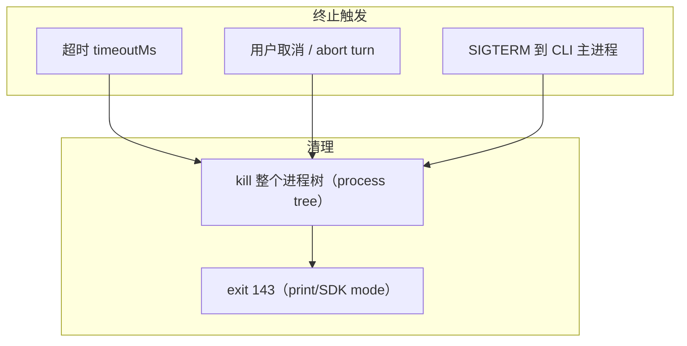

## Q6
python task.py 启动 shell、编译器或后台进程后，哪些限制自动继承？依据是什么？超时、取消或主进程退出时，如何处理整个进程树？请指出清理逻辑与相关测试。
### Answer
## 直接回答

子进程自动继承的限制：**mount namespace 文件系统视图、socat 网络出口白名单、可选的 PID namespace 与 memory cgroup**——这些都是内核级属性，后代进程无条件继承，无法逃逸，这就是继承的依据。超时/取消时引擎会杀死**整个进程树**（CHANGELOG 明确修复过 SIGTERM 遗留孤儿进程树的问题：abort turn → kill tree → exit 143）。本仓库不含清理逻辑的实现或测试，下面标注所有证据。 claude-code:2699-2699 claude-code:4863-4863 

---

## 子进程继承的限制

`python task.py` 在沙箱内再启动 shell/编译器/后台进程时，后代继承的是**内核绑定在进程上的属性**，而非应用层重新检查：

| 限制 | 继承机制 | 依据 |
|---|---|---|
| 文件系统视图（受保护路径、allowWrite 区域） | bwrap 创建的 mount namespace——所有后代在同一 ns 中 | claude-code:4210-4211  |
| 网络出口（域名白名单） | socat 代理转发，沙箱内进程无独立出站路径；auto mode 下 per-command `allowed_domains` 对该命令的全部后代生效 | claude-code:973-973  |
| PID 可见性 | `CLAUDE_CODE_SUBPROCESS_ENV_SCRUB` 时启用 PID namespace——后代看不到沙箱外进程，ns init 死亡时整树被内核清理 | claude-code:4863-4863  |
| 内存上限 | `CLAUDE_CODE_TOOL_MEMORY_LIMIT` 的 memory cgroup——cgroup 自动归组所有后代，OOM 作用于整组 | claude-code:2216-2216  |
| 环境变量 | `$.env.set` 设置的变量"for this process and everything it starts after" | claude-code:3012-3015  |

**注意不对称**：应用层的权限规则（`Bash(...)` 规则、静态分析器）只在**顶层命令**放行前评估一次；沙箱内后代的新动作（读文件、连网络）不再经过权限层，只受 OS 级边界约束。 claude-code:2943-2948 

## 超时 / 取消 / 退出的进程树清理



- **进程树而非单个 PID**：CHANGELOG 明确记录了 SIGTERM 修复——"the CLI now aborts the turn, **kills the tree**, and exits 143"，此前会遗留孤儿进程树。证明存在 tree-kill 逻辑，目标是整树。 claude-code:2699-2699 
- **超时**：`$.process.run` 文档写明"the child may run before it is **killed** and the call rejects"（默认 30 s，上限 10 min）；后台进程持续写输出会一直占用调用直到超时。 claude-code:2954-2960 claude-code:6488-6491 
- **PID ns 兜底**：沙箱内首进程被杀时，PID namespace 语义保证内核连孤儿的孤儿一起清理——这是继承模型自带的回收保证。 claude-code:4863-4863 
- **误伤防护**：曾修复 `pkill -f` 在沙箱命令中匹配到 CLI 自身进程导致会话被杀（Linux）。 claude-code:2655-2655 
- **后台会话（另一套生命周期）**：`/background`/`claude --bg` 会话由独立 daemon + worker 托管，闲置后需清理 daemon 和 worker，删除会话有 `claude rm`/agents view 路径；daemon 换代时的 control socket 清理也有专门修复。 claude-code:2665-2668 

## 清理逻辑与测试的位置

**都不在本仓库索引中**。`BashTool` 的 kill-tree 实现（job object / `kill(-pgid)` / cgroup freezer——具体机制不可见）、信号处理和测试文件均在私有实现仓库。CHANGELOG 中 "Fixed SIGTERM … orphaning the command's process tree" 隐含存在对应回归测试场景，但测试源码不可见。 claude-code:2699-2699 

## Notes
- "kill 整树"的精确机制（process group signal vs PID-ns init 死亡 vs cgroup kill）无法从索引确认；PID ns 模型下杀 init 即清整树是最可能的路径，但属推断。
- devcontainer 模型下没有逐命令进程树概念——防火墙作用于整个容器，进程清理由容器生命周期负责。 claude-code:55-56 
- 如需 `spawn`/`kill` 的函数级调用链和真实测试，请开 Devin session 访问完整源码。

Wiki pages you might want to explore:
- [Claude Code Overview (anthropics/claude-code)](/wiki/anthropics/claude-code#1)
### Citations
**File:** CHANGELOG.md (L973-973)
```markdown
- Added per-command `allowed_domains` to Bash, PowerShell and Monitor in auto mode with sandboxing: the hosts a command needs are reviewed with it and opened for it alone; other hosts are refused
```
**File:** CHANGELOG.md (L2216-2216)
```markdown
- Added opt-in memory cgroup support for Bash tool commands on Linux (`CLAUDE_CODE_TOOL_MEMORY_LIMIT`) so a runaway build can't stall the session
```
**File:** CHANGELOG.md (L2655-2655)
```markdown
- Fixed Bash tool killing the Claude session when a `pkill -f` pattern accidentally matched the CLI's own process (Linux)
```
**File:** CHANGELOG.md (L2665-2668)
```markdown
- Fixed a displaced background daemon deleting its successor's control socket on shutdown, which made the next client kill the healthy replacement daemon
- Fixed background sessions parked with `←` or `/background` and left idle keeping the background daemon and a worker process alive indefinitely
- Fixed completed background sessions being impossible to remove via `claude rm` or the agent view once the background service had gone idle
- Fixed background sessions dispatched from a non-git folder being impossible to delete from the agents view
```
**File:** CHANGELOG.md (L2699-2699)
```markdown
- Fixed SIGTERM during a running Bash tool orphaning the command's process tree in print/SDK mode; the CLI now aborts the turn, kills the tree, and exits 143
```
**File:** CHANGELOG.md (L4210-4211)
```markdown
- Added `worktree.baseRef` setting (`fresh` | `head`) to choose whether `--worktree`, `EnterWorktree`, and agent-isolation worktrees branch from `origin/<default>` or local `HEAD`. **Note:** the default `fresh` changes `EnterWorktree`'s base back to `origin/<default>` (it has been local `HEAD` since 2.1.128) — set `worktree.baseRef: "head"` to keep unpushed commits in new worktrees
- Added `sandbox.bwrapPath` and `sandbox.socatPath` managed settings (Linux/WSL) to specify custom bubblewrap and socat binary locations
```
**File:** CHANGELOG.md (L4863-4863)
```markdown
- Added subprocess sandboxing with PID namespace isolation on Linux when `CLAUDE_CODE_SUBPROCESS_ENV_SCRUB` is set, and `CLAUDE_CODE_SCRIPT_CAPS` env var to limit per-session script invocations
```
**File:** mods/types/claude-code.d.ts (L2943-2948)
```typescript
      /**
       * Commands on the host, run as the user the session runs as. CLI only.
       *
       * Local execution, not a network path: what a command of its own reaches
       * is its own, as for the Bash tool and a settings `command` hook.
       */
```
**File:** mods/types/claude-code.d.ts (L2954-2960)
```typescript
           * One shot: the whole output is read, so a background process left
           * writing holds the call until the timeout. Rejects when the command
           * cannot start or is still running then. Git runs with repo hooks off.
           *
           * @param argv the command and its arguments, `argv[0]` the executable
           * @param init `{ cwd, env, stdin, timeoutMs }` (cwd the session's by
           *             default; timeout 30 s by default, ten minutes at most)
```
**File:** mods/types/claude-code.d.ts (L3012-3015)
```typescript
           * Sets the variable for this process and everything it starts after, or
           * unsets it when `value` is `undefined`.
           *
           * `name` must be a string literal; `claude plugin validate` lists the
```
**File:** mods/types/claude-code.d.ts (L6488-6491)
```typescript
       * How long the child may run before it is killed and the call rejects,
       * in milliseconds; 30 seconds when absent, ten minutes at most.
       */
      timeoutMs?: number;
```
