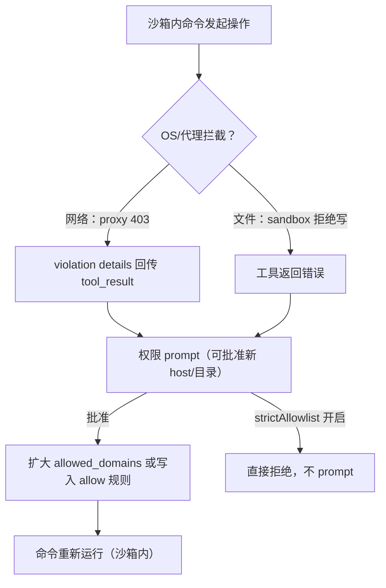

## Q7
操作被沙箱拒绝后，系统如何识别并发起审批？批准后是扩大特定目录或网络权限、重新创建沙箱，还是直接在沙箱外重试？授权作用于单次命令还是整个会话？沙箱不可用时，是拒绝执行还是降级运行？
### Answer
## 直接回答

- **识别**：网络拒绝由 sandbox proxy 返回（如 `curl` 拿到代理的 403），违规详情随 Bash 工具结果回传并触发审批 prompt；文件系统拒绝同理由工具返回错误后转为权限提示。 claude-code:1956-1956 claude-code:1972-1972 
- **批准后**：默认不是"沙箱外重试"，而是**为该命令放宽网络白名单**（per-command `allowed_domains`，"opened for it alone"）；文件系统侧则是写入 `allowWrite`/目录规则或在权限层放行。授权粒度默认是**单次命令**，但可存为持久 allow 规则作用于会话/项目/用户级。 claude-code:973-973 claude-code:1246-1246 
- **沙箱不可用**：默认**降级运行**（unsandboxed fallback，`sandbox.excludedCommands`）；`sandbox.failIfUnavailable` 使其启动失败而非裸奔。 claude-code:5229-5229 claude-code:582-582 

---

## 拒绝 → 审批的识别路径



- 网络拒绝的识别点：曾修复"blocked command still exited 0（`curl` 打印代理 403 页面）时违规详情被丢弃"的 bug——说明违规信息是代理写入输出、由工具结果解析呈现的。 claude-code:1956-1956 
- 默认行为是 prompt：`sandbox.network.strictAllowlist` 的存在（"deny … **without prompting**"）反证未开启时非白名单 host 会进入审批。 claude-code:2505-2505 
- 有意设计为"先尝试再批准"：Bash prompt 不再列出已允许 host，让 Claude 主动请求、用户按需批准。 claude-code:1972-1972 
- 审批通道可在远程：`--channels` permission relay 能把工具审批 prompt 转发到手机。 claude-code:5307-5307 

## 批准后：扩沙箱，而非出沙箱

| 维度 | 行为 |
|---|---|
| **网络** | auto mode 下每条命令声明 `allowed_domains`，"the hosts a command needs are reviewed with it and **opened for it alone**"——批准只对这条命令的这次运行放行该 host。 claude-code:973-973  |
| **文件系统** | 批准后走权限规则层（`Edit(...)`/`allowWrite` 规则、`additionalDirectories` 中途增删即时生效）；沙箱侧目录授权由配置区域控制，未见"动态重建沙箱"的证据。 claude-code:4879-4880  |
| **持久化粒度** | "always allow" 可存到不同层级（VSCode 用方向键选规则保存位置），即授权可从单次扩展到会话/用户/项目级持久规则。 claude-code:1246-1246  |
| **会话级记忆** | 保存的 allow 规则对后续命令生效；re-sent permission approval 在 remote 会话中也可应用，说明授权与命令解耦、按规则复用。 claude-code:1570-1570  |

## 沙箱不可用：默认降级，可选 fail-fast

- `sandbox.failIfUnavailable`：开启后沙箱启用但无法启动时**报错退出**；该设置的存在直接证明默认是"running **unsandboxed**"降级。 claude-code:5229-5229 
- VSCode 的 Sandbox dialog 明确暴露三个概念：sandbox mode、**unsandboxed fallback**、`sandbox.excludedCommands`——不可沙箱化的命令走豁免路径。 claude-code:582-582 claude-code:5602-5602 
- managed settings 可强制要求沙箱（"organizations whose managed settings require sandboxing"），此时降级路径被关闭。 claude-code:1275-1275 
- 关联的凭据保护：`CLAUDE_CODE_SUBPROCESS_ENV_SCRUB=1` 对 Bash 工具、hooks、MCP stdio 子进程剥离 Anthropic/云凭据，即使降级也不泄漏密钥。 claude-code:5231-5231 

## Notes

- "批准后重试是沙箱内重跑还是沙箱外重跑"在索引中没有逐行实现证据；per-command `allowed_domains` 的措辞（"opened for it alone"）表明网络路径是**放宽后沙箱内重跑**，文件系统侧批准主要落在权限规则而非重建 namespace。需逐行确认请开 Devin session。
- `sandbox.excludedCommands` 是"明确标记不走沙箱"的命令清单，与"沙箱启动失败后的 fallback"是两个不同的降级口子。 claude-code:5602-5602 

Wiki pages you might want to explore:
- [Claude Code Overview (anthropics/claude-code)](/wiki/anthropics/claude-code#1)

Wiki pages you might want to explore:
- [Claude Code Overview (anthropics/claude-code)](/wiki/anthropics/claude-code#1)
### Citations
**File:** CHANGELOG.md (L973-973)
```markdown
- Added per-command `allowed_domains` to Bash, PowerShell and Monitor in auto mode with sandboxing: the hosts a command needs are reviewed with it and opened for it alone; other hosts are refused
```
**File:** CHANGELOG.md (L1246-1246)
```markdown
- [VSCode] Added Left and Right arrow keys to change where an always-allow permission rule is saved, for keyboard and screen reader users
```
**File:** CHANGELOG.md (L1275-1275)
```markdown
- Fixed Cowork scheduled tasks in the cloud failing at startup for organizations whose managed settings require sandboxing
```
**File:** CHANGELOG.md (L1570-1570)
```markdown
- Fixed remote and scheduled sessions failing with "user messages must have non-empty content" after a re-sent permission approval could not be applied
```
**File:** CHANGELOG.md (L1956-1956)
```markdown
- Fixed sandbox network-violation details being dropped from the Bash tool result when the blocked command still exited 0 (for example `curl` printing the proxy's 403 page)
```
**File:** CHANGELOG.md (L1972-1972)
```markdown
- Changed the sandboxed Bash tool prompt to no longer list allowed network hosts, so Claude attempts requests (and you can approve new hosts) instead of assuming unlisted hosts are blocked
```
**File:** CHANGELOG.md (L2505-2505)
```markdown
- Added `sandbox.network.strictAllowlist` setting to deny non-allowlisted hosts for sandboxed commands without prompting
```
**File:** CHANGELOG.md (L4879-4880)
```markdown
- Fixed `permissions.additionalDirectories` changes not applying mid-session — removed directories lose access immediately and added ones work without restart
- Fixed removing a directory from `additionalDirectories` revoking access to the same directory passed via `--add-dir`
```
**File:** CHANGELOG.md (L5229-5229)
```markdown
- Added `sandbox.failIfUnavailable` setting to exit with an error when sandbox is enabled but cannot start, instead of running unsandboxed
```
**File:** CHANGELOG.md (L5231-5231)
```markdown
- Added `CLAUDE_CODE_SUBPROCESS_ENV_SCRUB=1` to strip Anthropic and cloud provider credentials from subprocess environments (Bash tool, hooks, MCP stdio servers)
```
**File:** CHANGELOG.md (L5307-5307)
```markdown
- Added `--channels` permission relay — channel servers that declare the permission capability can forward tool approval prompts to your phone
```
**File:** CHANGELOG.md (L5602-5602)
```markdown
- Fixed several permission rule matching issues: wildcard rules not matching commands with heredocs, embedded newlines, or no arguments; `sandbox.excludedCommands` failing with env var prefixes; "always allow" suggesting overly broad prefixes for nested CLI tools; and deny rules not applying to all command forms
```
**File:** feed.xml (L582-582)
```text
&lt;p&gt;• [VSCode] Added a Sandbox dialog for the sandbox mode, the unsandboxed fallback and excluded commands, opened from the panel menu or by typing /sandbox&lt;/p&gt;
```
