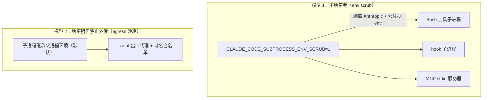

## Q8
Agent 主进程使用的 API key、环境变量、SSH agent、Docker socket 和云凭据，哪些会传入工具执行环境？是否存在外部代理代为认证？请区分“不把密钥交给程序”和“交给程序但禁止外传”。
### Answer
## 直接回答

**默认模型是"交给子进程但靠网络沙箱禁止外传"；`CLAUDE_CODE_SUBPROCESS_ENV_SCRUB=1` 才切换为"不把密钥交给程序"**——它会从 Bash 工具、hooks、MCP stdio 服务器的子进程环境中剥离 Anthropic 和云提供方凭据，并在 Linux 上附带 PID namespace 隔离。 claude-code:5231-5231 claude-code:4863-4863 

确实存在**外部代理/helper 代认证**模式：`apiKeyHelper`（`--bare` 模式要求它或 `ANTHROPIC_API_KEY`）、MCP `headersHelper`（helper 脚本产 header，可服务多个 server）、CI 的 workload identity federation token 交换。 claude-code:5306-5306 claude-code:5151-5151 claude-code:1945-1945 

SSH agent 和 Docker socket 在索引中**没有专门证据**——它们是 Unix socket，落到文件系统隔离（bwrap mount ns / Seatbelt）而非网络白名单的范畴。

---

## 详细分解

### 两种防护模型的对应



### 各凭据类型逐项

| 凭据 | 是否传入工具环境 | 证据 |
|---|---|---|
| `ANTHROPIC_API_KEY` / OAuth token | **默认会进入**子进程环境——security hook 文档明确说 hook 可拿到 `ANTHROPIC_AUTH_TOKEN`（"Claude Code passes this automatically"）；设置 scrub 后剥离 | claude-code:48-53  |
| 云凭据（AWS/GCP 等） | 默认继承父进程 env；scrub 后剥离。Bedrock SigV4 签名在主进程内完成，曾修复与 `ANTHROPIC_AUTH_TOKEN`/`apiKeyHelper`/`ANTHROPIC_CUSTOM_HEADERS` 设置的 Authorization header 冲突 | claude-code:5231-5231 claude-code:4834-4834  |
| 其余环境变量 | 全量继承；`settings.json` 的 `env` 也注入（曾修复数字型 env 值的崩溃）；`NO_PROXY`/`no_proxy`、`HTTPS_PROXY` 被引擎自身消费 | claude-code:4850-4850 claude-code:1955-1955  |
| SSH agent（`SSH_AUTH_SOCK`） | 无直接证据。它是 Unix socket：若 env 被继承且 socket 路径在沙箱 mount ns 内可见，则子进程可用 agent 认证——**密钥本身不交给程序，agent 代签**，天然是模型 1；沙箱文件系统隔离可能遮住 socket 路径 | claude-code:2593-2593  |
| Docker socket（`/var/run/docker.sock`） | 同上，无直接证据；挂载该 socket 等价于给子进程 root 等价能力，是否被沙箱遮蔽取决于 bwrap/Seatbelt 的 mount 规则，索引中不可见 |  |
| macOS keychain 中的 OAuth token | keychain 归主进程持有；子进程拿到的只是 env 里的 `ANTHROPIC_AUTH_TOKEN` | claude-code:5211-5211  |

### 外部代理代认证的确切形态

- **`apiKeyHelper`**：`--bare` headless 模式明确"requires `ANTHROPIC_API_KEY` or an `apiKeyHelper` via `--settings` (OAuth and keychain auth disabled)"——即 helper 是替代密钥存储的取钥匙通道。 claude-code:5306-5306 
- **MCP `headersHelper`**：helper 脚本产出 auth header（而非静态 token），`CLAUDE_CODE_MCP_SERVER_NAME`/`URL` 注入让同一 helper 服务多 server；Reconnect 即重跑 helper。 claude-code:5151-5151 claude-code:4846-4846 
- **Workload identity federation（CI）**：token 交换在主进程侧完成，单用 token 的交换结果在同 job 进程间共享。 claude-code:1945-1945 
- **Socat 出口代理只做域名过滤，不做认证注入**——索引中没有"代理替程序签名/加 header"的证据。 claude-code:2469-2469 

### "禁止外传"一侧的保证

密钥即使进入子进程，外泄通道受网络沙箱约束：`sandbox.network.strictAllowlist`/per-command `allowed_domains` 使非白名单 host 不可达（或被 prompt 拦截），`/dev/tcp`、`/dev/udp` 重定向也被权限层拦下。 claude-code:2505-2505 claude-code:4871-4871 

注意残余风险：env 注入的 token 仍可能被写到 stdout 或白名单内的 host——scrub 模式正是为消除这个面而加。 claude-code:5231-5231 

## Notes

- 沙箱实现源码不在本仓库索引（发布型仓库），SSH agent socket 与 Docker socket 的具体 mount 处理无法确认；如需逐行验证，请开 Devin session。
- `CLAUDE_CODE_SCRIPT_CAPS` 与 scrub 同批引入，限制每会话脚本调用次数——同属子进程防护面。 claude-code:4863-4863 
- `TRACEPARENT` 会注入 Bash 子进程（OTEL 开启时），属于"有意传给子进程的非密钥 env"对照例。 claude-code:4866-4866 

Wiki pages you might want to explore:
- [Claude Code Overview (anthropics/claude-code)](/wiki/anthropics/claude-code#1)

Wiki pages you might want to explore:
- [Claude Code Overview (anthropics/claude-code)](/wiki/anthropics/claude-code#1)
### Citations
**File:** CHANGELOG.md (L1945-1945)
```markdown
- Fixed workload identity federation in CI: processes in one job share the exchanged token instead of re-exchanging the single-use token; a rejected exchange fails fast with the server's message
```
**File:** CHANGELOG.md (L1955-1955)
```markdown
- Fixed the local IDE connection being routed through `HTTPS_PROXY` (and sometimes failing) when `localhost` was listed in `NO_PROXY` but not lowercase `no_proxy`; both casings are now honored
```
**File:** CHANGELOG.md (L2469-2469)
```markdown
- Fixed sandboxed large uploads failing with TLS errors through the sandbox proxy
```
**File:** CHANGELOG.md (L2505-2505)
```markdown
- Added `sandbox.network.strictAllowlist` setting to deny non-allowlisted hosts for sandboxed commands without prompting
```
**File:** CHANGELOG.md (L2593-2593)
```markdown
- Added `sandbox.filesystem.disabled` setting to skip filesystem isolation while keeping network egress control
```
**File:** CHANGELOG.md (L4834-4834)
```markdown
- Fixed Bedrock SigV4 authentication failing with 403 when `ANTHROPIC_AUTH_TOKEN`, `apiKeyHelper`, or `ANTHROPIC_CUSTOM_HEADERS` set an Authorization header
```
**File:** CHANGELOG.md (L4846-4846)
```markdown
- Fixed the `/mcp` menu offering OAuth-specific actions for MCP servers configured with `headersHelper`; Reconnect is now offered instead to re-invoke the helper script
```
**File:** CHANGELOG.md (L4850-4850)
```markdown
- Fixed crash when `settings.json` env values are numbers instead of strings
```
**File:** CHANGELOG.md (L4863-4863)
```markdown
- Added subprocess sandboxing with PID namespace isolation on Linux when `CLAUDE_CODE_SUBPROCESS_ENV_SCRUB` is set, and `CLAUDE_CODE_SCRIPT_CAPS` env var to limit per-session script invocations
```
**File:** CHANGELOG.md (L4866-4866)
```markdown
- Added W3C `TRACEPARENT` env var to Bash tool subprocesses when OTEL tracing is enabled, so child-process spans correctly parent to Claude Code's trace tree
```
**File:** CHANGELOG.md (L4871-4871)
```markdown
- Fixed redirects to `/dev/tcp/...` or `/dev/udp/...` not prompting instead of auto-allowing
```
**File:** CHANGELOG.md (L5151-5151)
```markdown
- Added `CLAUDE_CODE_MCP_SERVER_NAME` and `CLAUDE_CODE_MCP_SERVER_URL` environment variables to MCP `headersHelper` scripts, allowing one helper to serve multiple servers
```
**File:** CHANGELOG.md (L5211-5211)
```markdown
- Fixed spurious "Not logged in" errors on macOS caused by transient keychain read failures
```
**File:** CHANGELOG.md (L5231-5231)
```markdown
- Added `CLAUDE_CODE_SUBPROCESS_ENV_SCRUB=1` to strip Anthropic and cloud provider credentials from subprocess environments (Bash tool, hooks, MCP stdio servers)
```
**File:** CHANGELOG.md (L5306-5306)
```markdown
- Added `--bare` flag for scripted `-p` calls — skips hooks, LSP, plugin sync, and skill directory walks; requires `ANTHROPIC_API_KEY` or an `apiKeyHelper` via `--settings` (OAuth and keychain auth disabled); auto-memory fully disabled
```
**File:** plugins/security-guidance/hooks/security_reminder_hook.py (L48-53)
```python
Other:
- SECURITY_REVIEW_MODEL: Model for LLM review (default: claude-opus-4-7)
- ANTHROPIC_API_KEY: Required for LLM-based reviews
- ANTHROPIC_AUTH_TOKEN: Alternative to API key — OAuth access token sent as Bearer auth.
  Claude Code passes this automatically for OAuth-authenticated users.
"""
```
