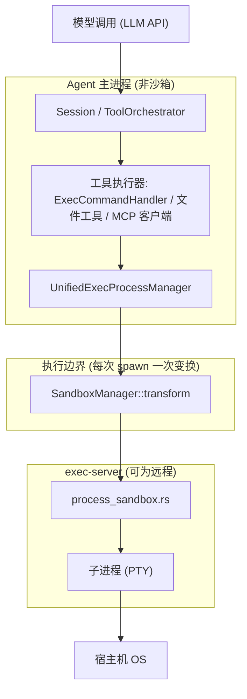

## Q1
本项目把哪些组件放进沙箱：整个 Agent 进程、单次 shell 命令，还是远程执行服务？请画出模型调用、Agent 主进程、工具执行器、子进程与宿主机之间的边界。文件工具、浏览器、MCP 服务是否经过同一边界？
### Answer
沙箱作用于**每一次被 spawn 的子进程（单条 shell 命令）**，而不是整个 Agent 主进程。`SandboxExecRequest` 的注释明确说这是"host-native launch request"，只能在执行边界（exec-server 或等效处）构建 codex:97-101 。远程执行器则自行实施 URI 原生的沙箱策略 codex:204-206 。文件工具、浏览器、MCP 不在我可见的代码片段中经过同一边界——文件操作在 exec-server 中有独立的 `sandboxed_file_system` 模块，浏览器/MCP 无证据表明被沙箱化 codex:44-48 。

---

## 边界图



## 详细说明

### 沙箱粒度：每次 spawn，而非整个进程

- `unified_exec` 的流程是：审批 → `SandboxManager` 选择沙箱类型 → `SandboxTransformRequest` 变换为 `ExecRequest` → spawn PTY；被沙箱拒绝时按策略用 `SandboxType::None` 重试 codex:8-18 。
- `ExecCommandHandler::handle_call` 在每次工具调用时执行此选择：本地环境走 `SandboxManager::select_initial`，远程环境（`environment.is_remote()`）跳过本地 cwd 解析，由远程执行器自己强制策略 codex:201-215 。
- 在 exec-server 一侧，`process_sandbox.rs` 构建 `SandboxDirectSpawnTransformRequest` 并对单个进程调用 transform codex:266-293 。

### 平台后端（同一抽象边界下的不同实现）

`SandboxManager` 统一分发到：macOS Seatbelt、Linux Bubblewrap/Landlock+seccomp、Windows 受限令牌/elevated runner，以及 MXC 容器后端 codex:1-27 codex:3-7 。

### 各组件是否过同一边界

| 组件 | 是否经沙箱边界 |
|---|---|
| `exec_command` / `write_stdin` shell 子进程 | ✅ 每次 spawn 经 `SandboxManager::transform` |
| 模型调用 | ❌ 在主进程内发起网络请求，不经沙箱 |
| 文件工具 | ⚠️ 不是进程沙箱，而是 exec-server 中独立的 `sandboxed_file_system` / `sandboxed_file_open` 路径级访问控制 codex:44-48  |
| 浏览器、MCP 服务 | ⚠️ 我可见的上下文没有证据表明它们经过此边界；MCP 通常作为 Agent 进程的外部进程或网络服务运行 |

## Notes

- 网络隔离是另一维度的边界：`ExecRequest.network` / `ManagedNetworkSandboxContext` 通过 `NetworkProxy` 独立施加 codex:50-72 。
- 由于索引大小限制，我无法看到浏览器工具和 MCP 客户端的具体实现文件；若需确认它们是否有独立隔离机制，建议开启一个 Devin 会话查看完整文件。

Wiki pages you might want to explore:
- [Unified Exec Process Management (openai/codex)](/wiki/openai/codex#5.3)
- [Sandboxing Implementation (openai/codex)](/wiki/openai/codex#5.6)
### Citations
**File:** codex-rs/sandboxing/src/manager.rs (L1-27)
```rust
use crate::LinuxSandboxPidNamespace;
#[cfg(target_os = "linux")]
use crate::bwrap::WSL1_BWRAP_WARNING;
#[cfg(target_os = "linux")]
use crate::bwrap::is_wsl1;
use crate::landlock::CODEX_LINUX_SANDBOX_ARG0;
use crate::landlock::create_linux_sandbox_command_args_for_permission_profile;
use crate::policy_transforms::effective_permission_profile;
use crate::policy_transforms::should_require_platform_sandbox;
#[cfg(target_os = "windows")]
use crate::resolve_windows_elevated_filesystem_overrides;
#[cfg(target_os = "windows")]
use crate::resolve_windows_restricted_token_filesystem_overrides;
#[cfg(target_os = "macos")]
use crate::seatbelt::MacosSeatbeltProfile;
#[cfg(target_os = "windows")]
use crate::windows_sandbox_uses_elevated_backend;
use codex_network_proxy::ManagedNetworkSandboxContext;
use codex_network_proxy::NetworkProxy;
use codex_protocol::config_types::WindowsSandboxLevel;
use codex_protocol::models::AdditionalPermissionProfile;
use codex_protocol::models::PermissionProfile;
use codex_protocol::permissions::FileSystemSandboxPolicy;
use codex_protocol::permissions::NetworkSandboxPolicy;
use codex_protocol::protocol::SandboxPolicy;
use codex_protocol::sandbox::SandboxOverride;
pub use codex_protocol::sandbox::SandboxType;
```
**File:** codex-rs/sandboxing/src/manager.rs (L97-101)
```rust
/// A host-native launch request produced after [`SandboxManager::transform`] validates URI inputs.
/// Build this only at the execution boundary: in exec-server, or in its logical equivalent within
/// app-server. Orchestration and transport code should retain [`PathUri`] values and defer
/// conversion to native paths until this request is created.
#[derive(Clone, Debug)]
```
**File:** codex-rs/core/src/tools/handlers/unified_exec/exec_command.rs (L201-215)
```rust
        let environment = Arc::clone(&turn_environment.environment);
        let fs = environment.get_filesystem();

        // Remote executors enforce URI-native sandbox policy themselves. Only a host-local
        // sandbox needs a native cwd for resolving paths nested in the permissions config.
        let requires_host_native_cwd = !environment.is_remote()
            && SandboxManager::new().select_initial(
                turn_environment.permission_profile(),
                SandboxablePreference::Auto,
                codex_protocol::sandbox::effective_windows_sandbox_type(
                    turn_environment.config().windows_sandbox_type,
                    turn_environment.config().windows_sandbox_level,
                ),
                turn.network.is_some(),
            ) != SandboxType::None;
```
**File:** codex-rs/exec-server/src/lib.rs (L44-48)
```rust
#[cfg(any(target_os = "linux", target_os = "macos", target_os = "windows"))]
mod sandbox_integrity;
mod sandbox_selection;
mod sandboxed_file_open;
mod sandboxed_file_system;
```
**File:** codex-rs/core/src/unified_exec/mod.rs (L8-18)
```rust
//! - Spawns the PTY from a sandbox-transformed `ExecRequest`; on sandbox denial,
//!   retries without sandbox when policy allows (no re‑prompt thanks to caching).
//! - Uses the shared `is_likely_sandbox_denied` heuristic to keep denial messages
//!   consistent with other exec paths.
//!
//! Flow at a glance (open process)
//! 1) Build a small request `{ command, cwd }`.
//! 2) Orchestrator: approval (bypass/cache/prompt) → select sandbox → run.
//! 3) Runtime: transform `SandboxTransformRequest` -> `ExecRequest` -> spawn PTY.
//! 4) If denial, orchestrator retries with `SandboxType::None`.
//! 5) Process handle is returned with streaming output + metadata.
```
**File:** codex-rs/exec-server/src/process_sandbox.rs (L266-293)
```rust
    let transform_request = SandboxDirectSpawnTransformRequest {
        workspace_roots,
        windows_sandbox_proxy_settings_mode,
        transform: SandboxTransformRequest {
            command: SandboxCommand {
                program,
                args,
                cwd: params.cwd.clone(),
                env,
                managed_network,
                additional_permissions: None,
            },
            permissions: &permissions,
            sandbox,
            enforce_managed_network: params.enforce_managed_network,
            environment_id: None,
            network: None,
            sandbox_policy_cwd,
            sandbox_exe: if cfg!(windows) {
                Some(runtime_paths.codex_self_exe.as_path())
            } else {
                runtime_paths.codex_linux_sandbox_exe.as_deref()
            },
            use_legacy_landlock: sandbox_context.use_legacy_landlock,
            windows_sandbox_level: windows_sandbox_level.unwrap_or(WindowsSandboxLevel::Disabled),
        },
    };
    let mut request = if sandbox == SandboxType::WindowsRestrictedToken {
```
**File:** codex-rs/mxc-sandbox/README.md (L3-7)
```markdown
This crate routes a command through the current Codex executable and directly
into Microsoft's MXC `BaseContainerRunner`. It requires a working Windows
process security environment (PSEC). It never invokes MXC's AppContainer
dispatcher, edits host ACLs, creates sandbox users, runs setup, or requests
elevation. The existing Codex Windows sandboxes remain separate backends.
```
**File:** codex-rs/core/src/sandboxing/mod.rs (L50-72)
```rust
pub struct ExecRequest {
    pub command: Vec<String>,
    pub cwd: PathUri,
    pub env: HashMap<String, String>,
    pub(crate) exec_server_env_config: Option<ExecServerEnvConfig>,
    pub(crate) exec_server_shell_snapshot: Option<codex_exec_server::ShellSnapshotRequest>,
    pub network: Option<NetworkProxy>,
    pub network_environment_id: Option<String>,
    pub expiration: ExecExpiration,
    pub capture_policy: ExecCapturePolicy,
    pub sandbox: SandboxType,
    pub windows_sandbox_policy_cwd: PathUri,
    pub windows_sandbox_workspace_roots: Vec<AbsolutePathBuf>,
    // TODO(anp): Reconcile these backend copies with TurnEnvironment::sandbox_context
    // and exec_server_sandbox so local and remote launches use the same settings.
    pub windows_sandbox_level: WindowsSandboxLevel,
    pub permission_profile: PermissionProfile,
    pub(crate) windows_sandbox_filesystem_overrides: Option<WindowsSandboxFilesystemOverrides>,
    pub arg0: Option<String>,
    pub(crate) exec_server_sandbox: Option<FileSystemSandboxContext>,
    pub(crate) exec_server_enforce_managed_network: bool,
    pub(crate) exec_server_managed_network: Option<ManagedNetworkSandboxContext>,
    pub(crate) exec_server_network_proxy: Option<RemoteNetworkProxyLaunchConfig>,
```
